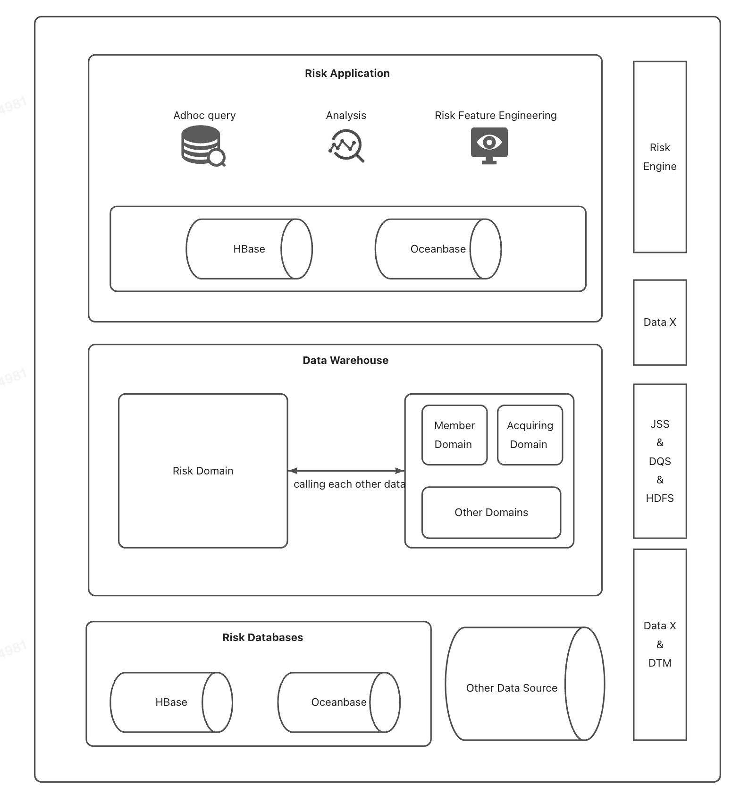

## 教务体系建设

**主题：** 履约域

**总线矩阵**

业务过程：用户购买正价课-到课-参课-完课-课程转化-复购/退课退款

维度：学员\课程\商品\班级\助教

**数仓建设**

ODS：15张后端数据快照表

DIM：小节、课程、商品、教育用户多身份表(助教表)、学员信息表

DWD 

| table            | 业务过程                                                     | 声明粒度         | 确认维度                                                   | 确认事实                               |
| :--------------- | ------------------------------------------------------------ | ---------------- | ---------------------------------------------------------- | -------------------------------------- |
| 一次学习记录宽表 | 学员参课完课的一次记录。课堂的时间、持续时长和相关资源的使用情况 | 课程ID+学员ID    | 学员维度；课程维度；时间维度；资源维度(教室资源，平台环境) | 学习时长；进出时间；课程状态           |
| 学员学习进度宽表 | 学员到课参课完课的周期和进度。                               | 一次学习记录的ID | 学员维度；课程维度；时间维度；资源维度                     | 学习持续时间；进度和完成情况；参与度； |
| 售后-换课表      |                                                              |                  |                                                            |                                        |
| 触达逻辑表       |                                                              |                  |                                                            |                                        |

DWS：

| table                | 聚集维度                                                     | 统计周期 | 聚集事实                                |
| -------------------- | ------------------------------------------------------------ | -------- | --------------------------------------- |
| 直播间粒度学习汇总表 | 每个 `resource_id` 表示一个独立的直播间，直播间是分析的主要实体 | 天       | 到课/完课人数；转化用户数，转化用户金额 |
| 线索正价课直播间转化 |                                                              |          |                                         |
| 课程粒度学习汇总表   |                                                              |          |                                         |

ADS：助教服务表\期数到课完课表\直播间在线人数

**数仓建设问题和难点：**

1. 触达未建设，期数到课完课，助教服务表都需要触达数据，四张ods表关联。业务需求变更，增加了指标以及指标的计算方式。ADS直接调用osd数据。  而且触达逻辑复杂：助教ods表，用户账户ods表，企业微信聊天记录表。

   解决方案：建设 触达逻辑表
2. 逻辑、指标重复建设

   **例子：** 一次进出直播间学习数据宽表和一次进出视频课的学习数据表=>一次学习记录宽表。
3. 数仓建设混乱。

   **例子：** 建设学员信息表在dwd层。存储学员的信息和课程学习记录。建设学员学习进度宽表。在dim层建设学员信息表。
4. 指标定义不一致：

   周数的定义：业务方认为小节距离第一节课的开课时间有多少周，也就是每个小节的周数不一样；数仓的定义是结束时间-开课时间，整个课开了多少周

**数据本身的问题：**

1. 测试数据和真实数据未分离，且未标识。例如，存在很多课程命名为0的数据，对计算汇总数据影响
2. 业务变更导致主键不唯一，但是业务方未知。例如，crm的线索clue_id对应一个订单id（业务方认为）。实际探查中，一个clue_id对应多个order_id，且clue_id本应唯一，存在重复数据。
3. 数据字段混乱，不一致。需要反复确认

**质量控制：**

1. 数据源探查，数据主键(业务变更主键不唯一)、数据量(数据量与数据建设完成后的数据量一致)，key值的唯一性（防止笛卡尔积或者数据量对不上），null或者0检测，type类型检测，
2. 数据表建设完成后数据自测：1、主键唯一性； 2、数据量对比；3、null值检测，type类型及数据量检测
3. DQC监控：唯一性监控、掉0监控或者其他数据量波动检测、null值监控、特殊值监控（比如完课时间>开课时间）

**数据治理：**

1. 数据量不一致问题：可能一些限制条件不一致，例如：有些去掉null，有些去掉测试数据

**模型建设的思路：**

1、高内聚低耦合
将业务相近、粒度相同的数据设计为一个物理模型
将高频同时访问的数据设计在一起，把低频同时访问的数据分开存储

2、核心模型与拓展模型分离
建立核心模型和拓展模型体系，核心模型包括核心字段，常用字段；拓展模型包括个性化字段。降低维护成本

3、公共层逻辑下沉且主题单一
底层公用的处理逻辑在dwd层封装实现

4、成本与性能平衡

5、数据可回滚：不修改代码逻辑，重跑回滚结果不变

6、数据一致性
字段命名一致性
指标定义的口径一致性

6、命名清晰，符合命名系统要求

## 教育全链路

**业务路径：** 曝光点击-分配意向线索-加微信分配销售-引流课学习-购买正价课/退费-复购的业务过程进行串连。

* **生成线索** ：用户点击引流课广告并查看课程详情时，系统自动记录为线索。
* **跟进线索** ：销售团队联系线索，介绍课程细节，鼓励用户参加引流课。
* **生成意向** ：用户购买引流课程后，系统将此行为转化为购买正价课的意向。

**难点：** 多个意向对应一个线索，取最后一次意向对应的线索，保证唯一。

**数据表的旧问题：** 数据重复：同时销售也有可能是助教，但是销售，助教单独建设了两个表，数据重复

**操作产生的新问题：** 两个表合并，增加身份的字段，一个人的数据变成了两行（不同的身份），但是没有做好数据探查。下游数据2倍增长，指标的计算产生了误差


## 数据治理项目

**1、问题**

- 数据存储：随着业务线的增多，数据存储的压力也越来越大，公司提出降本增效的数据治理专项，减少存储压力
- 数据质量：1、主键不唯一，数据波动 2、数据链路运行时间过长
- 数据应用：缺乏统一的基础数据指标和应用分析标准：具体表现在各个业务线（业务含义一致，命名不一致；业务含义不一致，命名含义一致）。各个系统存在冗余（埋点组做了投放卡片转化的数据，教育线单独再做一套投放转化数据）。
- 业务代码定义混乱：早期个性化需求不符合当前的业务（线索不唯一），上层业务基于早期的数据表搭建，存在数据问题。业务开发的结果不符合业务方预期

**2、治理方案：**

- 数据存储：梳理数据资产，对90天没有使用下游的数据进行下线操作；梳理表的生命周期，根据级别进行生命周期调整
- 数据质量：1、配置DQC监控 2、数据优化，减少运行时长
- 数据应用：统一命名系统，保持数据命名一致性
- 业务代码定义混乱：联合业务进行业务梳理，重新进行数据构建

**3、工作步骤：**

- 拉取线上平台数据，整理90天没有任何使用下游的数据表
- 整理90天内运行时间超过1小时的数据表，整理成excel表
- 牵头对ods层进行调0监控QDC配置，以及重要资产的主键唯一性配置
- 拉取不合适的生命周期表，整理成excel

**4、成果：**

数据治理项目历时3个月，下线临时表与无效表46张，优化数据表30张，获得了2022技术中台降本增效「项目奖 - 大数据成本治理」奖项

## 智能中医药数据分析系统

**1、Apriori（关联）**

支持度：一个项集在所有业务中出现的频次

- 计算支持度->单项频繁项集->合并->计算多项频繁相集，中途剪枝->生成关联规则

置信度：A->B 在所有包含A的事物中也包含B的概念，在发生a的情况下，b也发生的概率

- 强关联规则。**置信度**(**A**→**B**)**=**支持度**(**A**∪**B**)/**支持度**(**A**)**

**2、ALBERT-BILSTM-CRF（命名实体识别）**

- ALBERT

  ALBERT用于学习和提取输入文本的深层语义特征，从而为下游任务（如命名实体识别）提供强大的上下文依赖的文本表示。
- BiLSTM

  在ALBERT提取的特征上进一步建模，BiLSTM可以细化这些特征，捕捉序列数据中的时间依赖性，为实体边界的精确预测提供支持。
- CRF

  CRF层接收BiLSTM的输出，并输出最可能的标签序列，考虑到标签之间的约束关系，以形成一致和合法的实体识别

**3、CNN算法（舌诊）**

- 自动特征提取
- 对每张图片进行详细的标注，包括舌头的颜色、形状、舌苔厚度和颜色

## 数据迁移任务

**背景：**

印尼DANA 计划将数据和任务从 DaaS CTU 迁移到阿⾥云（maxcompute）。

蚂蚁金融云（类似于阿里云）的架构：

* HDFS 数据存储
* DQS 任务开发
* JSS 任务调度和运行

数据源存储：

datax和dtm从hbase和oceanbase获取同步数据，datax和dtm

* Hbase  推送数据到数仓，以增量的数据形式
* Oceanbase  存储全量数据

数据同步⼯具： DTM 和 DataX

**前置探查**

* 上游数据是否有依赖其他领域的数据
* 下游有依赖迁移的数据的任务
* 检查daas中不属于本次迁移范围的其他任务是否包含本次迁移的数据表
* 检查迁移任务中有没有直接调用数据仓库的任务

**迁移步骤**

- 任务：将表结构复制到阿里云数据库；任务迁移；并行运行和数据验证

- 数据：数据导入到ODS层；打开Maxcompute到风险数据库的管道

- 脚本：配置数据验证脚本和监控；UDF迁移

**完成后测试与监控**

编写脚本进行数据量，数据值的对比

运行性能监控

```sql
SELECT
    (SELECT COUNT(*) FROM OldTable) AS OldTableCount,
    (SELECT COUNT(*) FROM NewTable) AS NewTableCount,
    (CASE 
        WHEN (SELECT COUNT(*) FROM (
            SELECT * FROM OldTable
            EXCEPT
            SELECT * FROM NewTable
        ) t) = 0 AND (SELECT COUNT(*) FROM (
            SELECT * FROM NewTable
            EXCEPT
            SELECT * FROM OldTable
        ) t) = 0 THEN 'Data match'
        ELSE 'Data do not match'
    END) AS DataComparisonResult;
```




## [大数据量场景](https://juejin.cn/post/7222787944296267831)

**分治、Hash、BitMap、布隆过滤器、堆排序**

### 1.两个大文件里找到重复URL

问题：A文件有 50亿条 url(url为字符串)，B文件也有 50亿条 url，每条 ur大小为 64B,在一台只有 4G内存的机器上计算，怎么找出A,B中相同的 url?

1G=1024M B=1024 * 1024 KB  = 1024* 1024 * 1024 B ~= 10^9 B

50亿 URL= 50 * 10^8 * 64 B =32 * 10^10 B = 320G

解答：

首先遍历文件 a，对遍历到的 URL 通过哈希取模的方式：hash（URL）%100，根据计算结果把 URL 放入 a0，a1 ... a99.txt 这 100 个文件中，每个文件大小约为 3.2 GB。用同样的方法遍历文件 b，将 URL 拆分到 b0, b1 ... b99.txt 文件中。

拆分过后，所有可能相同的 URL 都在对应的小文件中，即 a0 对应 b0，...，a99 对应 b99。接下来只需求出这 100 对小文件中相同的 URL 就好了。

求相同的 URL，可以用 HashSet/HashMap 的方式，当 URL 存在 Set/Map 中时，说明 URL 重复，就可以把重复的 URL 保存在单独的文件中，最终合并所有相同的 URL 即可。

### 2.海量个数字中，找出不重复的整数

问题：在 100 亿个整数中找出不重复的数字，注意：内存不足以容纳这么多个整数。

100 x 10^8 x 4B 约为 40GB

1. HashMap+分治

   100亿个整数分配到1000个文件，每个文件存储1000万个整数，编号0-999，遍历存入HashMap。

   再计算只出现一次的整数
2. 位图法

   我们用 2 个 bit 来表示数字出现的状态：00 表示没出现过、01 表示出现过一次、10 表示出现了多次。100 亿整数都是 int 类型，每个整数占 4 个字节，即 32 个 bit，需要的内存为 2^32 x 2bit = 1GB。

   当可用内存大于 1GB 时，可用位图法解决本题。通过遍历这 100 亿个数，将对应下标 00->01（整数出现 1 次），01->10（整数出现多次），最后统计 01（只出现了一次）的个数即可。

### 3.海量电话号码中，统计不同号码的个数

**位图法**

由于电话号码长度为 11 位，每一位上的数字有 10 种情况，因此需申请长度为 1 千亿（10^11）的 bit 数组，大约需要内存 10^11 x 1bit 约为 12.5GB。遍历所有的号码，当出现该号码时将该数组位置为 1，用一个数 count 记录第一次置为 1 的位图元素，遍历结束后得出最终结果。

## 开发流程
